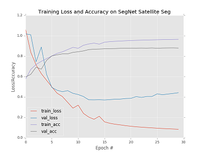
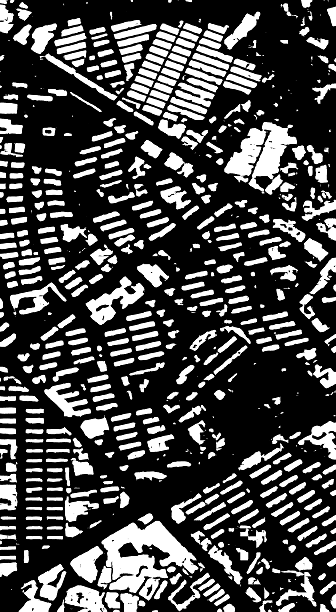
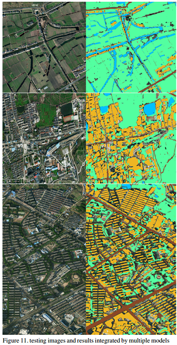

# Satellite-Segmentation

This is a satellite remote sensing segmentation project wirtten by Keras based on SegNet and U-Net.

## main ideas
1. segmented by SegNet
2. segmented by U-Net
3. model emsamble: SegNet + U-Net

## other ideas
1. GAN pix2pix: generate some fake satellite images to enlarge the dataset
2. DeepLab
3. Mask RCNN
4. FCN
5. RefineNet
6. post-processing: CRF

<div align="center">

</div>


<div align="center">


</div>


## 4月2日更新

我上传了我预处理后的数据集，一份是专门给segnet训练，一份是给unet训练的(只上传了buildings的数据集)，所以如果不想自己处理原始数据的话，可以下载我的预处理后的数据跑跑效果看看。建议先跑SegNet效果再跑Unet效果。

预处理后的数据集：
```
链接：https://pan.baidu.com/s/1FwHkvp2esvhyOx1eSZfkog 密码：fqnw
```

下载之后可以看到里面有三个文件夹，分别是用于测试的图片，用于unet训练的图片（里面是src和label文件夹），用于segnet的图片(里面是src和label文件夹)。对于segnet训练集我已经切割好了，但是unet的还没切割，所以需要执行该文件生成unet训练集：
```
python ./unet/gen_dataset.py
```
在执行之前需要先在该文件里面图片读取路径修改为我上传的unet训练集路径，输出路径也要修改一下。


### 怎么跑SegNet？
可以先在segnet_train.py里修改filepath ，改成segnet训练集的路径，然后
训练：
```
python segnet_train.py --model segnet.h5
```
--model后面接的是训练之后得到的模型名字

预测：待预测的图片的路径在segnet_predict.py里面修改
```
python segnet_predict.py
```

### 怎么跑Unet?
训练：
```
python unet_train.py --model unet_buildings20.h5 --data ./unet_train/buildings/
```
--model后面接的是训练之后得到的模型名字，--data后面接的是unet的训练集路径

预测：unet_predict.py里面改预测图片的所在路径
```
python unet_predict.py
```

### 怎么做label可视化？
1. 有朋友反映原始数据集里的训练集有些图片全黑，这是因为这些图片是十六位的！比赛方就是这么折腾人，所以一般图片浏览器无法显示这些16位图，解决方法：
深度16位的图片转8位：matlab下：im2 = uint8(im1);

2. label怎么都是黑色的啊？因为每类的标签的值都是1到5啊，像素1~5当然是黑色啊！想看看标签长什么样的解决方法：参考介个文件：
```
https://github.com/AstarLight/Satellite-Segmentation/blob/master/draw_lables.cpp
```

这里我用cpp做了可视化，当然用Python写也是不难的。可视化之后，你也会发现赛会方在又给我们设置第二坑了~


original dataset download：

链接：https://pan.baidu.com/s/1i6oMukH 

密码：yqj2


Please visit my blog for more details: http://www.cnblogs.com/skyfsm/p/8330882.html
